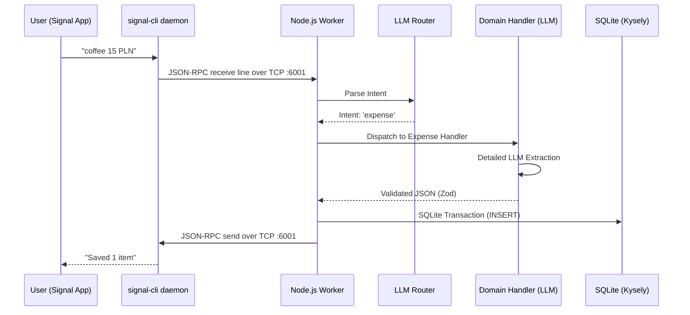

# Architecture

This document describes the high-level architecture and data flow of the Signal Expense Tracker.

## Data Flow

The application runs as a single background worker connecting directly to the
`signal-cli` daemon over a raw TCP JSON-RPC connection. There are no external
HTTP or WebSocket endpoints exposed.



## Core Principles

1. **Single Node.js Process:** No Express, Fastify, or additional web servers. A single `worker.ts` process owns the raw TCP JSON-RPC connection and its bounded receive dispatcher.
2. **Two-Step LLM Routing:** 
   - Step 1: Global Router identifies the intent (`expense`, `report`, `ignore`) using a small, strict Zod schema.
   - Step 2: Domain handlers execute secondary, detailed LLM prompts for specific tasks.
3. **Database (SQLite):** 
   - Uses `better-sqlite3` and `kysely`.
   - Financial amounts are stored strictly as `INTEGER` representing cents/groszy.
   - Requires transactions for data integrity.
4. **Vercel AI Gateway:** All LLM calls route through Vercel AI Gateway to easily swap providers (OpenAI/Anthropic) without changing application logic.

## Directory Structure Map

```text
src/
├── config.ts           # Environment variables validation and setup
├── worker.ts           # Main entry point, sets up TCP JSON-RPC and graceful shutdown
├── worker/
│   └── dispatch.ts     # Core message routing logic
├── signal/
│   ├── client.ts       # Raw TCP JSON-RPC client and bounded receive lifecycle
│   ├── receive-queue.ts # Bounded Buffer framer and FIFO receive dispatcher
│   └── envelope.ts     # Signal JSON-RPC payload types
├── llm/
│   ├── provider.ts     # Vercel AI Gateway setup
│   └── generate.ts     # Wrapper around Vercel AI SDK generateObject
├── routing/            # Global Router (Step 1)
├── domains/
│   ├── expenses/       # Expense parsing, schema, and DB repository
│   └── reports/        # Report generation, date boundaries, and DB queries
├── db/
│   ├── connection.ts   # Kysely & better-sqlite3 instantiation
│   └── schema.ts       # Main database schema definitions
├── tracing.ts          # Optional Langfuse telemetry
└── lib/                # Shared utilities
```
