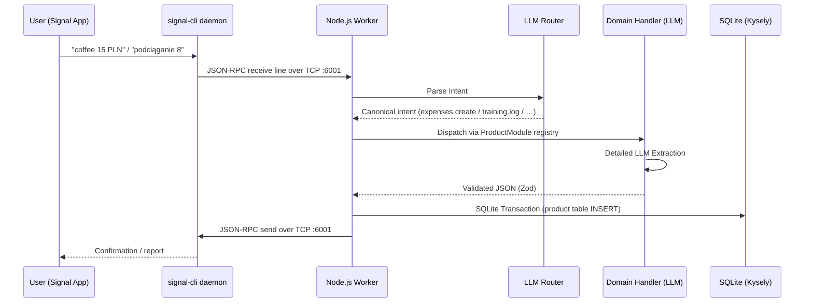

# Architecture

This document describes the high-level architecture and data flow of the Signal multi-product tracker (expenses + training).

## Data Flow

The application runs as a single background worker connecting directly to the
`signal-cli` daemon over a raw TCP JSON-RPC connection. There are no external
HTTP or WebSocket endpoints exposed.



## Core Principles

1. **Single Node.js Process:** No Express, Fastify, or additional web servers. A single `worker.ts` process owns the raw TCP JSON-RPC connection and its bounded receive dispatcher.
2. **Two-Step LLM Routing:** 
   - Step 1: Global Router classifies into canonical intents (`expenses.*`, `training.*`, `ignore`). Legacy expense intent strings are accepted only when replaying old `parsed_json` (ADR 0023).
   - Step 2: The selected product domain handler executes a secondary, detailed LLM prompt for the specific task.
3. **Products:** Business domains live under `src/products/<product>/domains/`. A `ProductModule` registry drives dispatch. Signal/inbox remain product-agnostic. Cross-product mixed messages are fail-closed to `ignore`.
4. **Database (SQLite):**
   - Uses `better-sqlite3` and `kysely`.
   - Financial amounts are stored strictly as `INTEGER` representing cents/groszy.
   - Training metrics use `INTEGER` grams / seconds / reps (no floats).
   - Requires transactions for data integrity.
5. **Durable Inbox:** Signal payloads are persisted before processing and move through `pending -> analyzed -> saved -> confirmed`, with retry and delivery recovery. Terminal rows are retained for 90 days.
6. **Vercel AI Gateway:** All LLM calls route through Vercel AI Gateway to easily swap providers (OpenAI/Anthropic) without changing application logic.

## Directory Structure Map

```text
src/
├── config.ts           # Environment variables validation and setup
├── worker.ts           # Main entry point, sets up TCP JSON-RPC and graceful shutdown
├── worker/
│   ├── inbox.ts        # Stable inbox facade for ingest, processing, and polling
│   ├── inbox/          # Inbox storage, policy, legacy handling, delivery, and runner
│   └── dispatch.ts     # Registry-driven product analyze/persist coordination
├── signal/
│   ├── client.ts       # Raw TCP JSON-RPC client and bounded receive lifecycle
│   ├── receive-queue.ts # Bounded Buffer framer and FIFO receive dispatcher
│   └── envelope.ts     # Signal JSON-RPC payload types
├── llm/
│   ├── provider.ts     # Vercel AI Gateway setup
│   └── generate.ts     # Wrapper around Vercel AI SDK generateObject
├── routing/            # Global Router (Step 1) + intent aliases
├── products/
│   ├── types.ts        # ProductModule contract
│   ├── registry.ts     # Explicit product registry (unique ids/intents)
│   ├── index.ts        # Registered products
│   ├── expenses/       # Expense product
│   │   └── domains/
│   │       ├── expenses/
│   │       ├── reports/
│   │       ├── categories/
│   │       └── modifications/
│   └── training/       # Training product
│       └── domains/
│           ├── entries/   # training.log
│           └── reports/   # training.report
├── db/
│   ├── connection.ts   # Kysely & better-sqlite3 facade and schema orchestration
│   ├── bootstrap.ts    # Base tables and indexes
│   ├── migrations.ts   # Existing schema migrations and rebuilds
│   ├── seeds.ts        # Default category seed
│   └── schema.ts       # Main database schema definitions
├── tracing.ts          # Optional Langfuse telemetry
└── lib/                # Shared utilities
```
